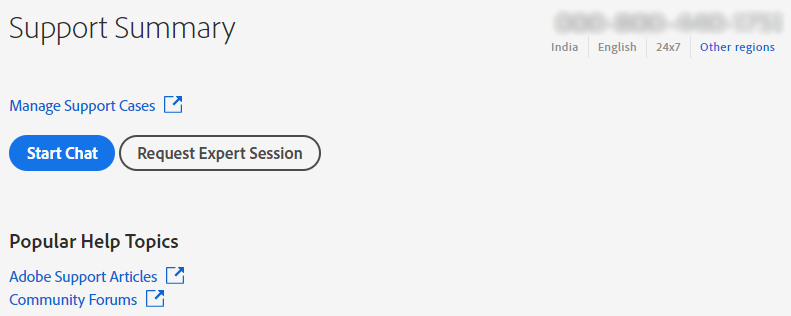

# Enterprise och team | Kontakta Adobe kundtjänst

Om du vill kontakta Adobe kundtjänst går du till fliken **Support** i [Admin Console](https://adminconsole.adobe.com/).

På fliken **Support** i [Admin Console](https://adminconsole.adobe.com/) kan du komma åt olika supportalternativ via ett enkelt och lättanvänt gränssnitt. Vilka alternativ som är tillgängliga på fliken Support beror på din prenumerationsplan. Mer information får du om du klickar på **Läs mer** som motsvarar din prenumerationsplan.

Om du är osäker på din prenumerationsplan går du till fliken **Support** på [Admin Console](https://adminconsole.adobe.com/) och jämför din vy med bilderna nedan. Klicka sedan på motsvarande **Läs mer**-länk.

## För team

<!--
[Learn more](https://helpx.adobe.com/enterprise/using/support-for-teams.html)
-->

## För företagskonto

<!--
[Learn more](https://helpx.adobe.com/enterprise/using/support-for-enterprise.html)
-->

## För Experience Cloud

<!--
[Learn more](https://www.adobe.com/go/ac_ec_not_supported_en)
-->
