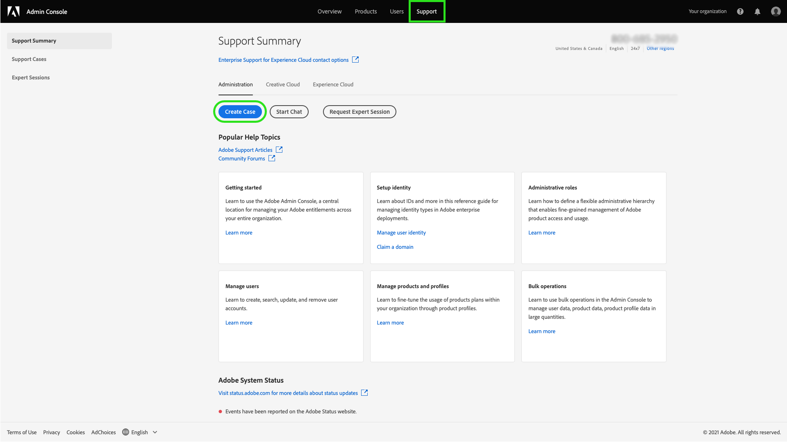
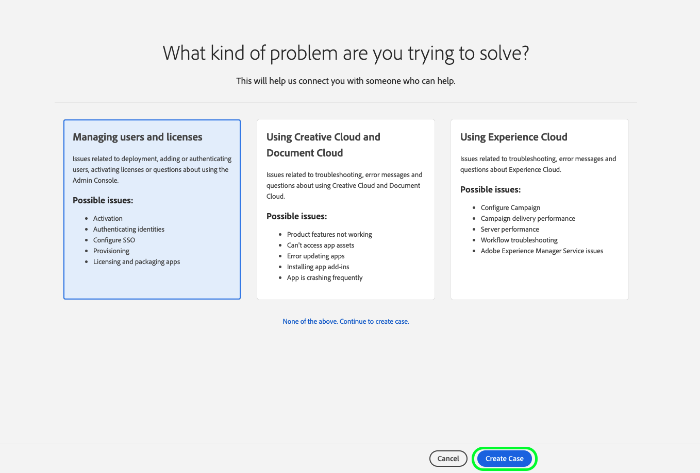
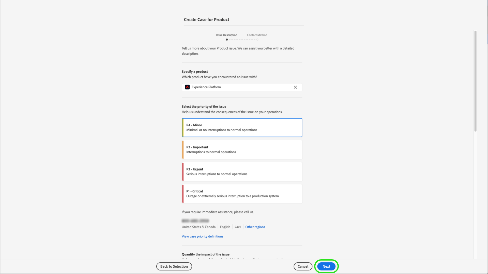

# Adobe Customer Support Experience

## Admin Console supportbiljetter

Supportbiljetter kan nu skickas via [Admin Console](https://adminconsole.adobe.com/). Instruktioner om hur du skickar in en supportanmälan finns i avsnittet [skicka en supportanmälan](#submit-ticket).

Vi arbetar för att förbättra ditt sätt att interagera med Adobe kundsupport. Vår vision är att effektivisera supportarbetet genom att gå över till en enda startpunkt med Adobe Admin Console. När ni är klara kommer ni enkelt att få tillgång till Adobe kundsupport; ha större insyn i servicehistoriken via ett gemensamt system för alla produkter, och begär hjälp via telefon, webben och chatt via en enda portal.

## Behöver du hjälp med den nya supportplattformen?

Vi erbjuder ett antal onlinemöten där kunderna kan ställa frågor om den nya supportprocessen. Markera en eller flera att ansluta till:

| Detalj | Dag | Datum | Registreringslänkar |
|--- |--- |--- |--- |
| [7 april 08 PT](https://event.on24.com/wcc/r/3723732/5288A3B031AD858BF241EB0C0057CD85) | Thours | 7 apr | <https://event.on24.com/wcc/r/3723732/5288A3B031AD858BF241EB0C0057CD85> |
| [17 april PT](https://event.on24.com/wcc/r/3723733/286EFEA9E8D9B6BB49464862F5414B8C) | Thours | 7 apr | <https://event.on24.com/wcc/r/3723733/286EFEA9E8D9B6BB49464862F5414B8C> |
| [20 april kl. 8.00 PT](https://event.on24.com/wcc/r/3712143/05DAF046E4BB864E7C313B056ADE4EB2) | Wed | 20 apr | <https://event.on24.com/wcc/r/3712143/05DAF046E4BB864E7C313B056ADE4EB2> |
| [20 april kl. 17.00 PT](https://event.on24.com/wcc/r/3723740/A9EDA45FA61D3FFC4BF713419B677F16) | Wed | 20 feb | <https://event.on24.com/wcc/r/3723740/A9EDA45FA61D3FFC4BF713419B677F16> |
| [21 april kl. 8.00 PT](https://event.on24.com/wcc/r/3723741/C7EBCD38583D4D7AFCBD56029EB17C98) | Thours | 21 apr | <https://event.on24.com/wcc/r/3723741/C7EBCD38583D4D7AFCBD56029EB17C98> |
| [21 april kl. 17.00 PT](https://event.on24.com/wcc/r/3723743/6F41ED2648A621F1419A56F0A52F4446) | Thours | 21 apr | <https://event.on24.com/wcc/r/3723743/6F41ED2648A621F1419A56F0A52F4446> |

## Skicka in en supportanmälan för Admin Console {#submit-ticket}

För att skicka in en supportanmälan i [Admin Console](https://adminconsole.adobe.com/)måste du ha administratörsrollen Support tilldelad av en systemadministratör. Endast en systemadministratör i din organisation kan tilldela den här rollen. Produkt, produktprofil och andra administrativa roller kan inte tilldela supportadministratörsrollen och kan inte visa **[!UICONTROL Create Case]** det alternativ som användes för att skicka in en supportanmälan. Mer information finns på [företag och team kundtjänst](https://helpx.adobe.com/enterprise/using/support-and-expert-services.html) dokumentation.

### Tilldela administratörsrollen för support

Supportadministratörsrollen är en icke-administrativ roll som har åtkomst till supportrelaterad information. Supportadministratörer kan visa, skapa och hantera problemrapporter.

Om du vill tilldela administratörsrollen för support följer du [redigera företagsadministratörsroll](https://helpx.adobe.com/enterprise/using/admin-roles.html#add-admin-teams) anvisningar i dokumentationen för administrativa roller. Observera att endast en systemadministratör för din organisation kan tilldela den här rollen. Mer information om administrativ hierarki finns på [administrativa roller](https://helpx.adobe.com/enterprise/admin-guide.html/enterprise/using/admin-roles.ug.html) dokumentation.

### Skapa en supportanmälan med Admin Console

Skapa en biljett med [Admin Console](https://adminconsole.adobe.com/)väljer du **[!UICONTROL Support]** i den övre navigeringen. The [!UICONTROL Support Summary] visas. Välj sedan **[!UICONTROL Create Case]** alternativ.

>[!TIP]
>
> Om du inte kan se **[!UICONTROL Create Case]** eller **[!UICONTROL Support]** måste du kontakta en systemadministratör för att tilldela supportadministratörsrollen.

En dialogruta visas där du kan välja en problemtyp. Välj den problemtyp som bäst beskriver ditt problem eller din fråga och välj sedan **[!UICONTROL Create Case]** längst ned till höger.

The **[!UICONTROL Create Case]** visas. Du ombeds att ange viss information, t.ex. produkt, prioritet, beskrivning och bifoga skärmdumpar för att beskriva problemet. Välj **[!UICONTROL Next]** för att fortsätta.

>[!NOTE]
>
> Om problemet leder till driftavbrott eller mycket allvarliga avbrott i ett produktionssystem tillhandahålls ett telefonnummer för omedelbar hjälp.

På nästa sida kan du fylla i kontaktinformation och ge Adobe kundsupport den bästa tiden att kontakta dig. När du är klar väljer du **[!UICONTROL Submit]** längst ned till höger och din biljett skickas till Adobe kundsupport.

<!--

## What About the Legacy Systems?

New Tickets/Cases will no longer be able to be submitted in legacy systems as of May 11th.  The [Admin Console](https://adminconsole.adobe.com/) will be used to submit new tickets/cases.

### Existing Tickets/Cases

* Between May 11th and May 20th the legacy systems will remain available to work existing tickets/cases to completion.
* Beginning May 20th the support team will migrate remaining open cases from the legacy systems to the new support experience.  You will receive an email notification regarding how to contact support to continue to work these cases.
-->
