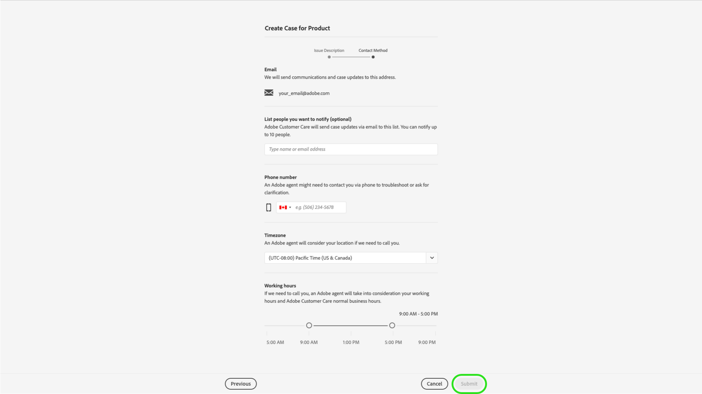

# Adobe Customer Support Experience

## Admin Console supportbiljetter

Supportbiljetter kan nu skickas via [Admin Console](https://adminconsole.adobe.com/). Instruktioner om hur du skickar en supportanmälan finns i avsnittet om att [skicka en supportanmälan](#submit-ticket).

Vi arbetar för att förbättra ditt sätt att interagera med Adobe kundsupport. Vår vision är att effektivisera supportarbetet genom att gå över till en enda startpunkt med Adobe Admin Console. När du är klar kommer din organisation enkelt att få tillgång till kundsupport på Adobe, få bättre insyn i servicehistoriken via ett gemensamt system för alla produkter samt begära hjälp via telefon, webben och chatt via en enda portal.

## Skicka in en supportanmälan till Admin Console {#submit-ticket}

Om du vill skicka in en supportanmälan i [Admin Console](https://adminconsole.adobe.com/) måste du ha tilldelats rollen som supportadministratör av en systemadministratör. Endast en systemadministratör i din organisation kan tilldela den här rollen. Produkt, produktprofil och andra administrativa roller kan inte tilldela supportadministratörsrollen och kan inte visa alternativet **[!UICONTROL Create Case]** som används för att skicka ett supportärende. Mer information finns i dokumentationen för [Enterprise and teams Customer Care](customer-care.md).

### Tilldela administratörsrollen för support

Supportadministratörsrollen är en icke-administrativ roll som har åtkomst till supportrelaterad information. Supportadministratörer kan visa, skapa och hantera problemrapporter.

Så här lägger du till eller bjuder in en administratör:

1. I Admin Console väljer du **[!UICONTROL Users]** > **[!UICONTROL Administrators]**.
1. Klicka på **[!UICONTROL Add Admin]**.
1. Ange namn eller e-postadress.

   Du kan söka efter befintliga användare eller lägga till en ny användare genom att ange en giltig e-postadress och fylla i informationen på skärmen.

   

1. Klicka på **[!UICONTROL Next]**. En lista med administratörsroller visas.

Så här tilldelar du en supportadministratörsroll till en användare (gör det möjligt för en användare att kontakta support):

1. Välj alternativet **[!UICONTROL Support administrator]**.

   

1. Välj något av följande två alternativ:

   * Alternativ 1: **[!UICONTROL Basic support administrator]**. Välj det här alternativet om du vill ge användarsupporten åtkomst till alla lösningar (utom Marketo Engage).
   * Alternativ 2: **[!UICONTROL Product support administrator]**: Välj det här alternativet om du vill ha stöd för Marketo Engage. Välj vilka Marketo Engage-instanser som ska ge användaren support åtkomst.

   

1. När du har gjort markeringarna klickar du på **[!UICONTROL Save]**.

Användaren får en e-postinbjudan om de nya administratörsbehörigheterna från `message@adobe.com`.

Användarna måste klicka på **Kom igång** i e-postmeddelandet för att kunna gå med i organisationen. Om nya administratörer inte använder länken **Kom igång** i e-postinbjudan kan de inte logga in på Admin Console.

Som en del av inloggningsprocessen kan användare uppmanas att konfigurera en Adobe-profil om de inte redan har en. Om användare har flera profiler associerade med sin e-postadress måste användarna välja **Gå med i team** (om de uppmanas till det) och sedan välja den profil som är associerad med den nya organisationen.

Mer information finns i anvisningarna för [Redigera företagsadministratörsroll](admin-roles.md#add-enterprise-role) i dokumentationen för administrativa roller. Observera att endast en systemadministratör för din organisation kan tilldela den här rollen. Mer information om administrativ hierarki finns i dokumentationen för [administrativa roller](admin-roles.md).

### Skapa en supportanmälan med Admin Console

Om du vill skapa en biljett med [Admin Console](https://adminconsole.adobe.com/) väljer du fliken **[!UICONTROL Support]** i den övre navigeringen. Sidan [!UICONTROL Support Summary] visas. Välj sedan alternativet **[!UICONTROL Create Case]**.

>[!TIP]
>
> Om du inte kan se alternativet **[!UICONTROL Create Case]** eller fliken **[!UICONTROL Support]** måste du kontakta en systemadministratör för att tilldela administratörsrollen för support.

En dialogruta visas där du kan välja en problemtyp. Välj den problemtyp som bäst beskriver ditt problem eller din fråga och välj sedan **[!UICONTROL Create Case]** längst ned till höger.

Dialogrutan **[!UICONTROL Create Case]** visas. Du ombeds att ange viss information, t.ex. produkt, prioritet, beskrivning och bifoga skärmdumpar för att beskriva problemet. Välj **[!UICONTROL Next]** om du vill fortsätta.

>[!NOTE]
>
> Om problemet leder till driftavbrott eller mycket allvarliga avbrott i ett produktionssystem tillhandahålls ett telefonnummer för omedelbar hjälp.

På nästa sida kan du fylla i kontaktinformation och ge Adobe kundsupport den bästa tiden att kontakta dig. När du är klar väljer du **[!UICONTROL Submit]** längst ned till höger och din biljett skickas till Adobe kundsupport.

<!--

## What About the Legacy Systems?

New Tickets/Cases will no longer be able to be submitted in legacy systems as of May 11th.  The [Admin Console](https://adminconsole.adobe.com/) will be used to submit new tickets/cases.

### Existing Tickets/Cases

* Between May 11th and May 20th the legacy systems will remain available to work existing tickets/cases to completion.
* Beginning May 20th the support team will migrate remaining open cases from the legacy systems to the new support experience.  You will receive an email notification regarding how to contact support to continue to work these cases.
-->
